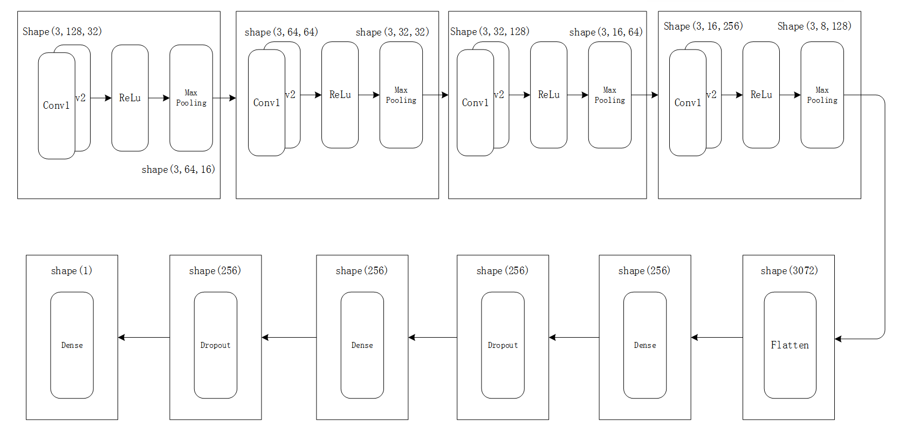
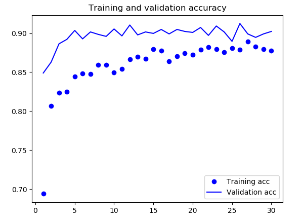

# Cat Vs Dog
## 项目文件夹目录介绍：

- [CatVsDog](CatVsDog) : 为 Web 项目的文件夹设置
- [catVdog](catVsdog) ： 为 Web 项目的应用文件夹
- [media](media) ： 保存了 Web 页面上的静态图片内容
- [templates](templates) ： 为 Web 页面的 Html 页面
- [venv](venv) ： 所有 cnn 的内容
  - [Include](venv/Include) ： 所有的 cnn 内容
    - [VGG](venv/Include/VGG) : 用的 VGG 模型搭建的 cnn 模型
      - [data](venv/Include/VGG/data) : 参照具体步骤的数据集的建立
    - [cnn](venv/Include/cnn) : 自己搭建的 cnn 模型
      - [data](venv/Include/cnn/data) ： train/test
  - [Lib/tcl8.6](venv/Lib/tcl8.6) ： 存包的文件，需要读者自行下载所需包
- [db.sqlite3](db.sqlite3) ： Django 自带的数据库
- [manage.py](manage.py) ： Django 执行脚本
- [requirements.txt](requirements.txt)

**数据集百度云链接：https://pan.baidu.com/s/1qsvmq3uwqr79ykI5FblV8g**
**提取码：yun5**

**训练好的模型百度云链接：https://pan.baidu.com/s/1FNs_WPPVJbnVPW8auHypCw** 
**提取码：wylv**

**B站项目介绍视频地址：https://www.bilibili.com/video/av50237864/**

## 项目简介

- **该项目是基于 Keras 的猫狗识别 web 应用。**
- **数据集是来自 Kaggle 上的猫狗大赛数据集，其中训练集 train 包含了猫的图片 12500 张以及狗的图片 12500 张，测试集 test 包含了猫狗的图片 12500 张。本项目采用了基于 Keras 的自己构造的 cnn 网络训练以及 Keras 中的 VGG16 卷积神经网络模型来进行训练数据，比较发现自己构造的 cnn 网络训练数据得到的模型不如 VGG16 训练数据得到的模型准确率高，自己训练的模型准确率在 70%-80% 之间，而 VGG16 的准确率在 95% 以上。**
- **最后还用了 Python 的 Django 框架简单的做了个展示页面，其中包括了本人及项目介绍图片的上传及预测结果展示的小功能。**

## 项目实现

### 所用技术

- Keras  搭建卷积神经网络
- Keras VGG16 搭建自己的卷积神经网络
- OpenCV 图像识别
- Django 框架
- Python 文件操作

### 项目流程图


------

## cnn 网络

### 网络图片展示



### 网络文字代码解释

**如上图所示，分别有四个输入不同的 `卷积层-->卷积层-->激活层-->Max池化层  `， 然后用 `Flatten 层` 是将图像展平成一维的列表，然后连接上两组 `Dense 层（全连接层）--> Dropout 层`，最后是一个 `Dense层` 进行最后的二分类。**

```python
from keras.models import Sequential 
from keras.layers import Conv2D 
from keras.layers import MaxPooling2D 
from keras.layers import Flatten 
from keras.layers import Dense 
```

> 第一行导入 Sequential 来初始化网络模型作为一个序列化网络。一般有两种基本方法去初始化网络，要么是各种层的序列，要么是用图的方式。 
>
> 第二行 引入 Conv2D 来完成卷积操作。我们这里使用的图像基本是 2 维数组，所以使用 Conv2D，当处理视频文件时要使用 Conv3D, 第三维是时间。 
>
> 第三行 引入 MaxPooling2D 用作池化操作。使用最大池化来保留感兴趣区域中的最大像素值。还有其他池化操作例如 MinPooling, MeanPooling. 
>
> 第四行引入扁平操作，用来转化所有 2 维数组到单个长的连续线性向量。 
>
> 第五行引入 Dense 层，用来完成网络的全连接。

#### **现在创建一个序列的 object**

###### 代码展示：

```python
ROWS = 128
COLS = 128
CHANNELS = 3

def catdog():
    model = Sequential()

    model.add(layers.Conv2D(32, (3, 3), padding="same", input_shape=(3, ROWS, COLS), activation='relu'))
    model.add(layers.Conv2D(32, (3, 3), padding="same", activation='relu'))
    model.add(layers.MaxPooling2D(pool_size=(2, 2), data_format="channels_first"))


    model.add(layers.Conv2D(64, (3, 3), padding="same", activation='relu'))
    model.add(layers.Conv2D(64, (3, 3), padding="same", activation='relu'))
    model.add(layers.MaxPooling2D(pool_size=(2, 2), data_format="channels_first"))

    model.add(layers.Conv2D(128, (3, 3), padding="same", activation='relu'))
    model.add(layers.Conv2D(128, (3, 3), padding="same", activation='relu'))
    model.add(layers.MaxPooling2D(pool_size=(2, 2), data_format="channels_first"))

    model.add(layers.Conv2D(256, (3, 3), padding="same", activation='relu'))
    model.add(layers.Conv2D(256, (3, 3), padding="same", activation='relu'))
    model.add(layers.MaxPooling2D(pool_size=(2, 2), data_format="channels_first"))

    model.add(layers.Flatten())
    model.add(layers.Dense(256, activation='relu'))
    model.add(layers.Dropout(0.5))

    model.add(layers.Dense(256, activation='relu'))
    model.add(layers.Dropout(0.5))

    model.add(layers.Dense(1))
    model.add(Activation('sigmoid'))

    model.compile(loss=objective, optimizer=optimizer, metrics=['accuracy'])
    model.summary()
    return model
```

##### 解释：

> `model = Sequential()`
> 增加第一个卷积操作： 
>
> `model.add(layers.Conv2D(32, (3, 3), padding="same", input_shape=(3, ROWS, COLS), activation='relu'))`
>
> 网络序列化的意思是我们可以通过 add 增加每一层到 model 上。Conv2D 函数包含 4 个参数，第一个是卷积核的个数也就是 32， 第二个参数时卷积核的大小也就是（3，3），第三个参数是输入大小和图像类型（RGB 还是黑白图）这里表示卷积网络输入 (128,128) 分辨率的图像，3 表示 RGB 图像。第四个参数为使用的激活函数。
>
> 接下来需要完成池化操作在相关特征图（由卷积操作之后产生的 32 个 feature maps）上。池化操作主要意图是减少图像大小。关键就是我们试图为下一层减少总共的节点数。
>
> `model.add(layers.MaxPooling2D(pool_size=(2, 2), data_format="channels_first"))`
> 我们使用 2*2 矩阵，最小化像素损失并得到特征定位的精确区域。我们在不损失精度时减少模型复杂度。 
>
> 接下来转化所有池化后图像到一个连续向量通过 Flattening 函数，将 2 维矩阵转化到一维向量。
>
> `model.add(layers.Flatten())`
>
> 然后创建全连接层。扁平后的节点将作为输入连接到全连接层。 
>
> `model.add(layers.Dense(256, activation='relu'))`
>
> Dense 函数创建一个全连接层，”units” 表示该层中定义的节点数，这些单元值一般在输入节点数和输出节点数之间，但只能通过实验来试出最好的值。
>
> `model.add(Activation('sigmoid'))`
>
> 最后初始化输出层，其只包含一个节点，对于二元分类来说。
>
> model.compile(loss=objective, optimizer=optimizer, metrics=['accuracy'])
>
> 现在完成了建立 CNN 模型，需要编译它。

## 项目展示

### 前端展示

- **项目主页**

  


- **上传图片**

  

  

- **查看结果**

  

  

### 后台展示


## 具体步骤

### 1.创建数据集

> 因为电脑性能的原因，只选择了训练集之中的2000张图片，以便我的电脑能够高效跑起来。
>
> 训练数据集分割成训练集、验证集、测试集，形成如下的 data 文件夹：
>
> 

```python
import os, shutil
# 数据集解压之后的目录
original_dataset_dir = 'data/train'
# 存放小数据集的目录
base_dir = 'data/small_data'

# 建立训练集、验证集、测试集目录
train_dir = os.path.join(base_dir, 'train')
# os.mkdir(train_dir)
validation_dir = os.path.join(base_dir, 'validation')
# os.mkdir(validation_dir)
test_dir = os.path.join(base_dir, 'test')
# os.mkdir(test_dir)

# 将猫狗照片按照训练、验证、测试分类
train_cats_dir = os.path.join(train_dir, 'cats')
os.mkdir(train_cats_dir)
train_dogs_dir = os.path.join(train_dir, 'dogs')
os.mkdir(train_dogs_dir)
validation_cats_dir = os.path.join(validation_dir, 'cats')
os.mkdir(validation_cats_dir)
validation_dogs_dir = os.path.join(validation_dir, 'dogs')
os.mkdir(validation_dogs_dir)
test_cats_dir = os.path.join(test_dir, 'cats')
os.mkdir(test_cats_dir)
test_dogs_dir = os.path.join(test_dir, 'dogs')
os.mkdir(test_dogs_dir)

# 切割数据集
fnames = ['cat.{}.jpg'.format(i) for i in range(1000)]
for fname in fnames:
    src = os.path.join(original_dataset_dir, fname)
    dat = os.path.join(train_cats_dir, fname)
    shutil.copyfile(src, dat)

fnames = ['cat.{}.jpg'.format(i) for i in range(1000, 1500)]
for fname in fnames:
    src = os.path.join(original_dataset_dir, fname)
    dat = os.path.join(validation_cats_dir, fname)
    shutil.copyfile(src, dat)

fnames = ['cat.{}.jpg'.format(i) for i in range(1500, 2000)]
for fname in fnames:
    src = os.path.join(original_dataset_dir, fname)
    dat = os.path.join(test_cats_dir, fname)
    shutil.copyfile(src, dat)

fnames = ['dog.{}.jpg'.format(i) for i in range(1000)]
for fname in fnames:
    src = os.path.join(original_dataset_dir, fname)
    dat = os.path.join(train_dogs_dir, fname)
    shutil.copyfile(src, dat)

fnames = ['dog.{}.jpg'.format(i) for i in range(1000, 1500)]
for fname in fnames:
    src = os.path.join(original_dataset_dir, fname)
    dat = os.path.join(validation_dogs_dir, fname)
    shutil.copyfile(src, dat)

fnames = ['dog.{}.jpg'.format(i) for i in range(1500, 2000)]
for fname in fnames:
    src = os.path.join(original_dataset_dir, fname)
    dat = os.path.join(test_dogs_dir, fname)
    shutil.copyfile(src, dat)
```

### 2. 创建模型

**参照上面的 cnn 网络中的 model**

### 3. 训练网络

#### （1）数据预处理——进行调整像素值的处理

> 在训练数据之前，需要预处理图像防止过拟合。首先在数据集上做数据增强 image augmentations
>
> 使用 keras.preprocessing 库来合成部分去准备训练集和测试集，字典的名称为所有图像呈现的类别对输入网络的图片数据
>
> - 读取图片文件；
> - 将 jpg 解码成 RGB 像素点；
> - 将这些像素点转换成浮点型张量；
> - 将 [0, 255] 区间的像素值减小到 [0, 1] 区间中，CNN 更喜欢处理小的输入值。

```python
# 调整像素值
train_datagen = ImageDataGenerator(rescale=1./255,
                                   rotation_range=40,
                                   width_shift_range=0.2,     # 宽度平移
                                   height_shift_range=0.2,   # 高度平移
                                   shear_range=0.2,            # 修剪
                                   zoom_range=0.2,            # 缩放
                                   horizontal_flip=True,
                                   fill_mode='nearest')
test_datagen = ImageDataGenerator( rescale=1./255,
                                   rotation_range=40,
                                   width_shift_range=0.2,     # 宽度平移
                                   height_shift_range=0.2,   # 高度平移
                                   shear_range=0.2,            # 修剪
                                   zoom_range=0.2,            # 缩放
                                   horizontal_flip=True,
                                   fill_mode='nearest')
```

#### 用 fit_generator 向模型中填充数据

```python
train_generator = train_datagen.flow_from_directory(
    directory=train_dir,
    target_size=(150, 150),
    batch_size=32,
    class_mode='binary')

validation_generator = test_datagen.flow_from_directory(
    directory=validation_dir,
    target_size=(150, 150),
    batch_size=20,
    class_mode='binary')
```

#### （3）容错机制——CheckPoint

```python
save_dir = os.path.join(os.getcwd(), 'saved_models')
filepath="model_{epoch:02d}-{val_acc:.2f}.hdf5"
checkpoint = ModelCheckpoint(os.path.join(save_dir, filepath), monitor='val_acc',verbose=1,
                            save_best_only=True)
```

#### （4）使用数据去拟合模型

> 其中 steps_per_epoch 表示训练样本个数，单个 epoch 表示训练一个神经网络。换句话说一张图片只在一个 epoch 中输入到网络中一次。

```python
# 利用批量生成器拟合模型
history = model.fit_generator(
    train_generator,
    steps_per_epoch=100,
    epochs=100,
    validation_data=validation_generator,
    validation_steps=50,
    callbacks=[checkpoint])
```

#### （5）保存模型

```python
model.save('cats_and_dogs_small.h5')
```

#### （6）显示训练中 loss 和 acc 的曲线

```python
acc = history.history['acc']
val_acc = history.history['val_acc']
loss = history.history['loss']
val_loss = history.history['val_loss']

epochs = range(1, len(acc) + 1)
plt.plot(epochs, acc, 'bo', label='Training acc')
plt.plot(epochs, val_acc, 'b', label='Validation acc')
plt.title('Training and validation accuracy')
plt.legend()
plt.figure()

plt.plot(epochs, loss, 'bo', label='Training loss')
plt.plot(epochs, val_loss, 'b', label='Validation loss')
plt.title('Training and validation loss')
plt.legend()
plt.show()
```

### 4. 预测

```python
def predict():

    TEST_DIR = 'E:/PycharmProjects/CatVsDog/media/img/'
    result = []
    model = load_model('E:\PycharmProjects\CatVsDog\\venv\Include\cnn\cats_and_dogs_small_4.h5')

    test_images = [TEST_DIR + i for i in os.listdir(TEST_DIR)]
    count = len(test_images)
    data = np.ndarray((count, ROWS, COLS, CHANNELS), dtype=np.uint8)
    print("图片网维度：")
    print(data.shape)

    for i, image_file in enumerate(test_images):
        image = read_image(image_file)
        data[i] = image
        if i % 250 == 0: print('处理 {} of {}'.format(i, count))

    test = data
    predictions = model.predict(test, verbose=0)
    dict = {}
    urls = []
    for i in test_images:
        ss = i.split('/')
        url = '/' + ss[3] + '/' + ss[4] + '/' + ss[5]
        urls.append(url)
    for i in range(0, len(predictions)):
        if predictions[i, 0] >= 0.5:
            print('I am {:.2%} sure this is a Dog'.format(predictions[i][0]))
            dict[urls[i]] = "图片预测为：Dog！"
        else:
            print('I am {:.2%} sure this is a Cat'.format(1 - predictions[i][0]))
            dict[urls[i]] = "图片预测为：Cat！"
        plt.imshow(test[i])
        plt.show()
    return dict
```

### 4. 改进——优化版本

#### 采用 VGG16 预训练网络之微调模型

因为以上的网络只能达到 75%-85% 的准确率，所以在这里我采用了 Keras 自带的预训练网络——VGG16 进行调节，之后的准确率能到达 95%。

- 自己搭建的网络模型准确率图像

  

- VGG16 预训练网络模型准确率

  

#### **微调（Fine-tuning）**

这也是另一种重用预训练模型的一种方式，微调就是我们解冻之前固定的 VGG16 模型，进行细微的调整，使模型与我们的问题更相关。

- 1）在一个已经训练好的基线网络上添加自定义网络；
- 2）冻结基线网络；
- 3）训练我们所添加的部分；
- 4）解冻一些基线网络中的卷积层；
- 5）将我们所添加的部分与解冻的卷积层相连接；

#### **VGG16 预训练模型代码：**

```python
path='D:/Downloads/vgg16_weights_tf_dim_ordering_tf_kernels_notop/vgg16_weights_tf_dim_ordering_tf_kernels_notop.h5'

conv_base = VGG16(weights=path,
                  include_top=False,
                  input_shape=(150, 150, 3))
set_trainable = False

for layer in conv_base.layers:
    if layer.name == 'block5_conv1':
        set_trainable = False
    if set_trainable:
        layer.trainable = True
    else:
        layer.trainable = False

model = models.Sequential()
model.add(conv_base)
model.add(layers.Flatten())
model.add(layers.Dense(256, activation='relu', input_dim=4 * 4 * 512))
model.add(layers.Dense(1, activation='sigmoid'))
```

## 项目总结

- **项目归属于图像识别类，主要解决的问题是图像分类中的二分类问题。合适的模型选择与搭建是解决问题的关键。当然，无论是解决任何问题，搭建的是哪种模型，采用的是什么算法，对数据集的探索总是少不了的。将数据集规范化的输入、剔除掉部分异常值等预处理，并利用图像增强技术训练搭建的模型，尝试不同的超参数组合并选择表现能力最强的模型作为我们的最终模型。**

- **项目中只是采用了单模型的训练预测，如果采用多个模型融合（比如 Stacking 模型融合）可能会取得更好的成绩。**

- **每次调参的会面临漫长的重新训练过程。如果先利用 model.predict_generator 函数来提取出训练集的特征向量（bottleneck features）, 然后再利用这些特征向量训练、调参、优化模型，会大大减少训练时间。**

- **电脑性能对我的模型训练有很大的影响，每次训练的时间在 5-6 个小时，最后的一次训练跑了近 13 个小时。**

- **经过本次学习加深了对深度学习，对卷积神经网络以及 Keras 的理解，但是并未登堂入室，下一步是继续学习 Keras 以及深度学习。**

  ------
